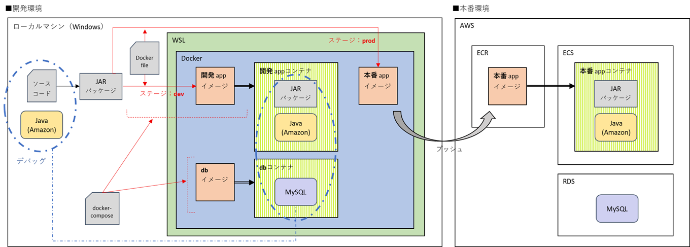
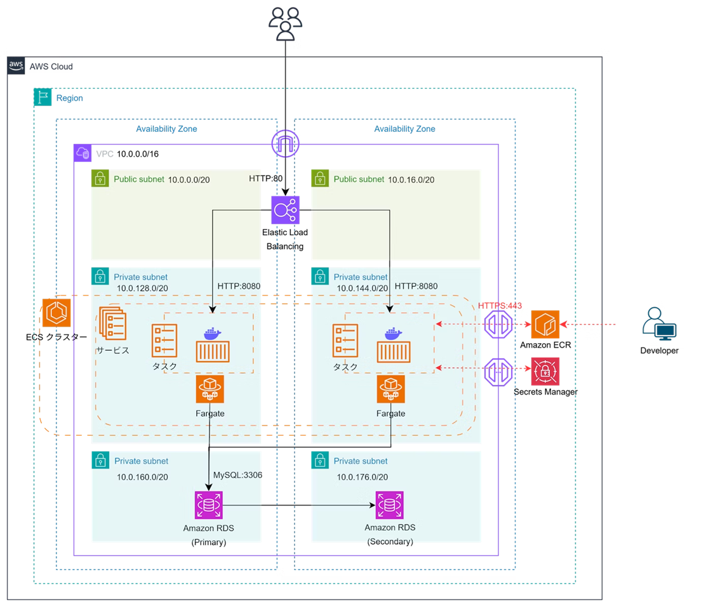

# ECS + RDS サンプルアプリ

> DB 利用を前提とした、AWS・Docker を使用した本番環境構築・デプロイに関する Qiita 記事用コンテナ化アプリケーション

## 📝 関連記事

- [【ECS + RDS】コンテナ化 Spring Boot/MySQL アプリの本番環境を構築 [前編] - 開発環境でのアプリ・DB 構築まで](https://qiita.com/okayu__11/items/08cfeb9f74a3b0a4a08e)
- [【ECS + RDS】コンテナ化 Spring Boot/MySQL アプリの本番環境を構築 [後編] - AWS インフラ構築とデプロイ](https://qiita.com/okayu__11/items/0cc6eb5b8647615f72f1)

## 🚀 クイックスタート

### 1. リポジトリのクローン

```bash
git clone https://github.com/y1221/qiita-spring-ecs-rds.git
cd your-repo
```

### 2. 環境変数の設定

```bash
# .env ファイルを作成
cp .env.example .env

# 必要な環境変数を設定
nano .env
```

#### 環境変数の例

```env
# データベース設定
DEV_DB_ROOTPASS=<任意のルートパスワード>
DEV_DB_DATABASE=<任意のデータベース名>
DEV_DB_USERNAME=<任意のユーザ名>
DEV_DB_PASSWORD=<任意のパスワード>
```

### 3. データベースの起動

```bash
docker compose up -d db
```

### 4. アプリケーションの起動

```bash
# ファイルの実行権限付与
chmod u+x mvnw

# パッケージング
./mvnw clean package

# 起動
docker compose up -d app
```

### 5. アクセス

http://localhost:8080/users

## 🛠️ 技術スタック

### バックエンド

- **言語**: Java 21
- **フレームワーク**: Spring Boot 3.5.4
- **データアクセス**: Spring Data JPA
- **テンプレートエンジン**: Thymeleaf
- **データベース**: MySQL 8.4.5

### 開発ツール

- **ビルドツール**: Maven 3.9.11
- **データベースマイグレーション**: Flyway

### インフラ

- **クラウド**: AWS
- **コンテナ**: Docker & Docker Compose

## 🏗️ システム構成

### 環境全体図



### AWS インフラ構成



## ⚙️ 前提条件

### 必要なソフトウェア

- **JDK**: 21 以上（開発時使用: JDK 21）
- **Docker**: 20.0 以上（開発時使用: Docker 27.3.1）

### 検証済み環境

- Ubuntu 24.04 LTS
- Windows 11 Home

## 👨‍💻 作者

**おかゆ**


- GitHub: [@y1221](https://github.com/y1221)
- Qiita: [@okayu\_\_11](https://qiita.com/okayu__11)
- X: [@okayu\_\_11](https://twitter.com/okayu__11)
